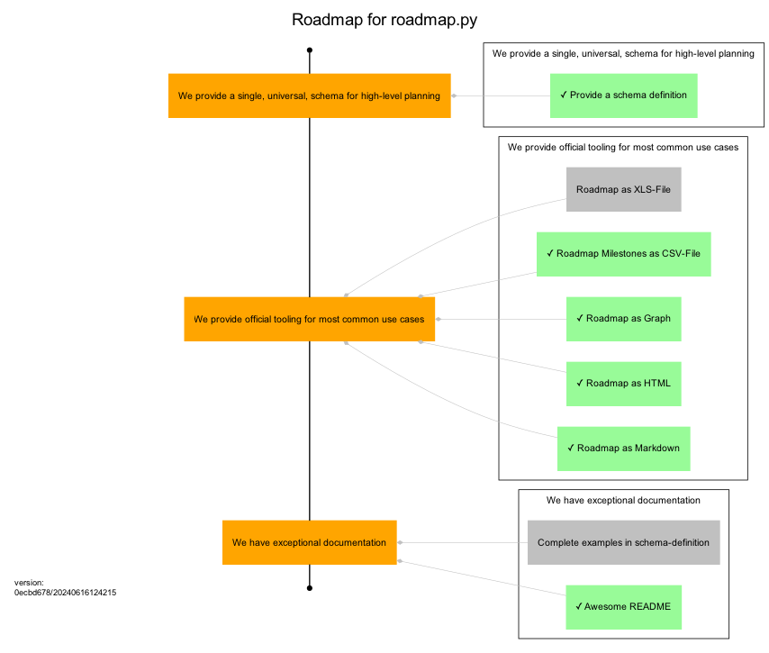

# Roadmap for roadmap.py

This is the planning roadmap for the [uroflavin/roadmap](https://github.com/uroflavin/roadmap) project. 
It acts as both the plan for implementing this tool as well as a demonstration of what a roadmap might look like.

One good example is this roadmap itself. 
What to-do and what is already done to implement roadmap.py can you see in this picture.

One of the things you'll immediately notice about this file is that it uses *Markdown* for formatting of text and is designed around a structured YAML schema. 
The goal is to make this as easy as possible for humans to read and reason about, while also enabling powerful visualizations to be generated based on the content.

## Authors

- Uroflavin *uroflavin@gmail.com*

## Importand Dates

- **2023-12-09**
    - <u>Project Start</u>
      This is the day that the project was started.

    - <u>Add a Test</u>
      We just add some test

- **2023-12-17**
    - <u>Demo Day</u>
      This is the scheduled date for the first demo of this project to a wider audience.

    - <u>Publish</u>
      This is the Date, we published this project
## Objectives

### We provide a single, universal, schema for high-level planning | ACHIEVED
The goal of this project is, primarily, to provide a single schema that can be used by different teams to describe the work they are doing and their future intentions. 
The usefulness and applicability of this schema to real-world problem domains will determine whether anything else we do here is of value.

- [see json-schema.org](https://json-schema.org/)

#### Keyresults
##### [R1] | Provide a schema definition | MUST DONE
Develop a schema that fulfills the main requirements of the objective
- [see README](https://github.com/uroflavin/roadmap/blob/main/schema/roadmap.json)

### We provide official tooling for most common use cases | COMMITED
While the goal of having a single unified schema for planning is that it enables the development of tools that automate various aspects of planning, most teams are not going to adopt this if the fundamentals aren't already solved for them. 
This includes things like being able to visualize your road map in common formats, validating it against the schema etc.

#### Keyresults
##### [R1] | Roadmap as Markdown | MUST DONE
We should be able to generate some markdown out of roadmap.yml

- [see Markdown-Template](https://github.com/uroflavin/roadmap/blob/main/templates/markdown/roadmap.md)

##### [R2] | Roadmap as HTML | MUST DONE
We should be able to generate some html out of roadmap.yml

- [see HTML-Template](https://github.com/uroflavin/roadmap/blob/main/templates/html/roadmap.html)

##### [R3] | Roadmap as Graph | MAY DONE
We should be able to generate some dot out of roadmap.yml

- [see DOT-Template](https://github.com/uroflavin/roadmap/blob/main/templates/dot/roadmap.dot)

##### [R4] | Roadmap Milestones as CSV-File | MAY DONE
Excel is THE projectmanagement tool. 
To render some progress in your favorite tool ;-) we should be able to generate some csv out of roadmap.yml-milestone and deliverables.
CSV is limited capable for exporting everything, so this would be a good first step towards Roadmap als XLS-File.

##### [R5] | Roadmap as XLS-File | MAY TODO
We should be able to generate some xls out of roadmap.yml

### We have exceptional documentation | COMMITED
Adoption of something intended to make planning easier is only going to be successful if it is easy to use, and a critical part of that is great documentation. 
Our goal is that someone with no familiarity with our tooling can ramp up and have an initial road map ready for use within only a few minutes.

#### Keyresults
##### [R1] | Awesome README | MUST DONE
We need to complete our README explaining the purpose of this project and giving some basic examples of its use.

- [see README](https://github.com/uroflavin/roadmap/blob/main/README.md)

##### [R2] | Complete examples in schema-definition | MAY TODO
Complete the examples so that every user of the schema is able to find suitable examples for their specific use cases
- [see schema/roadmap.json](https://github.com/uroflavin/roadmap/blob/main/schema/roadmap.json)

## Milestones

### #Design and Planning | Design and Planning | REACHED
The design and planning stage is where we're figuring out how this project should work and, broadly, what kind of information we want to show on our road maps.
We should do something for the [roadmap](https://github.com/uroflavin/roadmap), just to let us know, if the design is broken.

- [explaining design and planning principles](https://www.turing.com/blog/principles-of-software-development-guide/)
#### [Q4/2023] | README | MUST DONE
We need to add a README file explaining the purpose of this project and giving some basic examples of its use.

- [see README](https://github.com/uroflavin/roadmap/blob/main/README.md)

**_Quantifiers_**

- _Cost of Delay_: 20

- _Time Criticality_: 0
- _Opportunity Enablement / Risk Reduction_: 10

#### [Q4/2023] | Roadmap | MUST DONE
We need to know what the roadmap file format looks like, so we'll get started with an example roadmap to kick the tyres.

- [see roadmap.yml](https://github.com/uroflavin/roadmap/blob/main/examples/roadmap.yml)

**_Quantifiers_**
- **_Weighted Shortest Job First_: 2.00**
- _Jobsize_: 10
- _Cost of Delay_: 20
- _User Value / Business Value_: 10
- _Time Criticality_: 0
- _Opportunity Enablement / Risk Reduction_: 10

### #Roadmap Schema | Roadmap Schema | REACHED
Once we know how we want a road map file to look, we should put together a schema for the file. 
This will allow us to document the file structure and provide a first class editing experience to people using it.

#### [Q1/2024] | roadmap.schema.json | MUST DONE
Put together a JSONSchema file describing the road map file format.

- [see roadmap.json](https://github.com/uroflavin/roadmap/blob/main/schema/roadmap.json)

**_Quantifiers_**
- **_Weighted Shortest Job First_: 2.00**
- _Jobsize_: 10
- _Cost of Delay_: 20
- _User Value / Business Value_: 10
- _Time Criticality_: 0
- _Opportunity Enablement / Risk Reduction_: 10

#### [Q1/2024] | Publish Schema | MUST DONE
Publish the schema file on [github](https://https://github.com/uroflavin/roadmap) so that people can reference it easily.

- [see roadmap.json](https://github.com/uroflavin/roadmap/blob/main/schema/roadmap.json)

**_Quantifiers_**
- **_Weighted Shortest Job First_: 20.00**
- _Jobsize_: 1
- _Cost of Delay_: 20
- _User Value / Business Value_: 10
- _Time Criticality_: 0
- _Opportunity Enablement / Risk Reduction_: 10

### #M3 | Markdown Renderer | REACHED
The Goal is, to implement an markdown renderer, which is capable to render this yml as markdown.

#### [D1] | Understand SierraWorks Basic Markdown | MUST DONE
Understand the Syntax of the go-template from https://github.com/SierraSoftworks/roadmap/blob/main/tools/roadmap-md/roadmap.basic.md

**_Quantifiers_**
- **_Weighted Shortest Job First_: 0.00**
- _Jobsize_: 2
- _Cost of Delay_: 0
- _User Value / Business Value_: 0
- _Time Criticality_: 0
- _Opportunity Enablement / Risk Reduction_: 0

#### [D2] | jinja2 template | MUST DONE
Develop a jinja2 template for markdown output of the roadmap

**_Quantifiers_**
- **_Weighted Shortest Job First_: 1.22**
- _Jobsize_: 9
- _Cost of Delay_: 11
- _User Value / Business Value_: 1
- _Time Criticality_: 0
- _Opportunity Enablement / Risk Reduction_: 10

#### [D3] | markdown-renderer | MUST DONE
Put some code in roadmap.py to render roadmap as Markdown

- [see Markdown-result of this roadmap.yml](https://github.com/uroflavin/roadmap/blob/main/roadmap/roadmap.md)

**_Quantifiers_**
- **_Weighted Shortest Job First_: 2.00**
- _Jobsize_: 10
- _Cost of Delay_: 20
- _User Value / Business Value_: 10
- _Time Criticality_: 0
- _Opportunity Enablement / Risk Reduction_: 10

### #M4 | HTML | REACHED
The Goal is, to implement a html-renderer, which is capable to render this yml as html

#### [D1] | html-template from original source | MUST DONE
Develop a template for html output of the roadmap
Use SierraSoftworks-Go-Template as a starting point

- [see SierraSoftworks-Go-Template](https://github.com/SierraSoftworks/roadmap/blob/main/tools/roadmap-html/roadmap.html)

**_Quantifiers_**
- **_Weighted Shortest Job First_: 1.22**
- _Jobsize_: 9
- _Cost of Delay_: 11
- _User Value / Business Value_: 1
- _Time Criticality_: 0
- _Opportunity Enablement / Risk Reduction_: 10

#### [D2] | html-renderer | MUST DONE
Put some code in roadmap.py to render roadmap as HTML

- [see HTML-result of this roadmap.yml](https://github.com/uroflavin/roadmap/blob/main/roadmap/roadmap.html)

**_Quantifiers_**
- **_Weighted Shortest Job First_: 2.00**
- _Jobsize_: 10
- _Cost of Delay_: 20
- _User Value / Business Value_: 10
- _Time Criticality_: 0
- _Opportunity Enablement / Risk Reduction_: 10

### #M5 | Graphviz | REACHED
The Goal is, to implement a dot-file, which is capable to render this yml as graphviz.

#### [D1] | dot-template | MUST DONE
Develop a dot-template for graphviz output of the roadmap

- [see SierraSoftworks-Go-Template](https://github.com/SierraSoftworks/roadmap/blob/main/tools/roadmap-graphviz/roadmap.dot)

**_Quantifiers_**
- **_Weighted Shortest Job First_: 1.22**
- _Jobsize_: 9
- _Cost of Delay_: 11
- _User Value / Business Value_: 1
- _Time Criticality_: 0
- _Opportunity Enablement / Risk Reduction_: 10

#### [D2] | dot-renderer | MUST DONE
Put some code in roadmap.py to render roadmap as dot-file

**_Quantifiers_**
- **_Weighted Shortest Job First_: 2.00**
- _Jobsize_: 10
- _Cost of Delay_: 20
- _User Value / Business Value_: 10
- _Time Criticality_: 0
- _Opportunity Enablement / Risk Reduction_: 10

#### [D3] | convert dot as png | MAY DONE
Put some code in roadmap.py to convert dot-file to png
e.g. the generated file roadmap.dot.png can be used in your project description.

**_Quantifiers_**
- **_Weighted Shortest Job First_: 5.33**
- _Jobsize_: 3
- _Cost of Delay_: 16
- _User Value / Business Value_: 10
- _Time Criticality_: 0
- _Opportunity Enablement / Risk Reduction_: 6

### #M6 | XLS-File | COMMITED
The Goal is, to implement a xls-renderer, which is capable to render this yml as xls File to open in your prefered spreadsheet software.

#### [D1] | csv-template | MUST DOING
Develop a template for csv output of the roadmap
csv output should contain all roadmap items, without the meta-information regarding your project.

The following Roadmap Items will be exported:

- milestones
- deliverables
- objectives
- keyresults
- todos

for each object item the following attributes will be rendered:

- type: will be concatenated form the roadmap-object-name
- _id: internal id
- id
- requirement
- state
- title
- date
- description
- reference.name
- reference.link
- _has_todos: calculated if item it has any todos

- [see roadmap.csv](https://github.com/uroflavin/roadmap/blob/main/roadmap/roadmap.csv)

**_Quantifiers_**
- **_Weighted Shortest Job First_: 1.10**
- _Jobsize_: 10
- _Cost of Delay_: 11
- _User Value / Business Value_: 1
- _Time Criticality_: 0
- _Opportunity Enablement / Risk Reduction_: 10

#### [D2] | xls-renderer | MUST TODO
Put some code in roadmap.py to render roadmap as XLS File

**_Quantifiers_**
- **_Weighted Shortest Job First_: 2.00**
- _Jobsize_: 10
- _Cost of Delay_: 20
- _User Value / Business Value_: 10
- _Time Criticality_: 0
- _Opportunity Enablement / Risk Reduction_: 10

### #M7 | Web Renderer | IDEA
GraphViz is great, but being able to see things like the description of your deliverables and their current state is something that most users are probably going to find quite useful. 
Pair that with a need to make tinkering and experimentation easy and there are few things better than an interactive website to show your road map.
The goal here is to produce something which is easy and pleasurable to use, which shows your road map in a format which can be understood and makes interacting with it as low-fuss as possible.

##### TODO

- [ ] Carry out WSJF
We need more information about the size
- [X] Find out the dependencies of the Graphviz Library
What requirements does Graphviz have and what are the hurdles?
See [graphviz.org](https://graphviz.org/)

#### [D1] | Web Renderer | MUST TODO
The most important part of this milestone is the development of a web based renderer which can present a road map file. 
This renderer is going to form the basis for our user flows, including acting as a realtime preview for the editor and a final output for the repository viewer.      

**_Quantifiers_**

- _Jobsize_: 10

- _User Value / Business Value_: None

#### [D2] | Markdown To HTML as JINJA2 Function | SHOULD TODO
The renderer should support Markdown

**_Quantifiers_**

- _Time Criticality_: 0

#### [D3] | Renderer Package | MAY TODO
Some teams might want to host a version of the renderer on their own website, in which case we should provide them with a package that lets them use the Road Map web renderer

---
version:1a3e914d/20240611144905